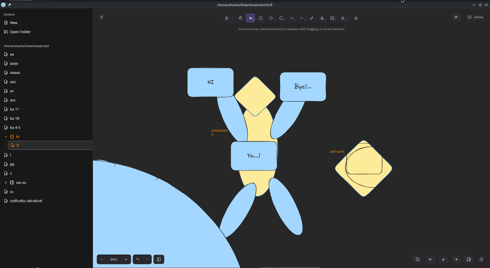

# Vortex



Vortex is my personal Knowledge Management System (KMS), designed to organize ideas, documents, and workflows visually. It is built around **Excalidraw**, giving me a fast, flexible, and intuitive canvas for thought.

## ✨ Features

- 🧩 Visual-first knowledge organization using Excalidraw
- 🗂️ Manage folders, PDFs, and Excalidraw Drawings all in one place
- ⚡ Fast local storage — no cloud required
- 🔍 Easy search and quick navigation using Tags

## 📦 Tech Stack

- **Electron**
- **React**
- **Excalidraw**
- **Node.js / fs**
- **ShadCN UI / Tailwind CSS**

## Structure

This project started as a simple Electron app, with the goal of replacing OneNote using an offline-first approach, similar to apps like Obsidian.

As the project evolved, I reused the renderer (frontend) from the Electron app and turned it into a web application, where an Express server handled the backend logic.

Taking it a step further, I adapted the same renderer again—this time embedding it inside an Android app using WebView. For better performance and native capabilities, I rewrote the backend logic in Kotlin with Gemini, which eventually transformed the project into a fully functional Android application.

## Setup

```bash
git clone https://github.com/excalidraw/excalidraw

git clone https://github.com/ShantoNoor/vortex.git

yarn --cwd ./vortex/electron-app install

# this will run the electron-app
yarn --cwd ./vortex/electron-app start
```

## Before runing the Android Project

- Complete the setup then run

```bash
cd vortex/electron-app/
yarn android
```

- This command will create the renderer needed for android project and place it inside the appropriate folder

- Now you can run the Android Project.

## Fedora Linux Build Issue Solve:

> https://github.com/electron/forge/issues/3701

### Find RPM Package Name:

```bash
rpm -qa | grep -i "vortex"
```

## Motivation

This project, _Vortex_, began as a personal hobby with the goal of creating an alternative to OneNote. As a long-time OneNote user, I had greatly appreciated its features and usability. However, I recently encountered persistent issues with Microsoft account authentication, which motivated me to build a replacement tailored to my own needs.

Vortex is built upon the foundations of several open-source technologies, and I am deeply grateful to the open-source community for making this project possible. In particular, I would like to extend special thanks to Excalidraw, without which this project would not have existed in its current form. I would also like to thank Gemini, DeepSeek, and ChatGPT for guiding me through every step of the development process.
